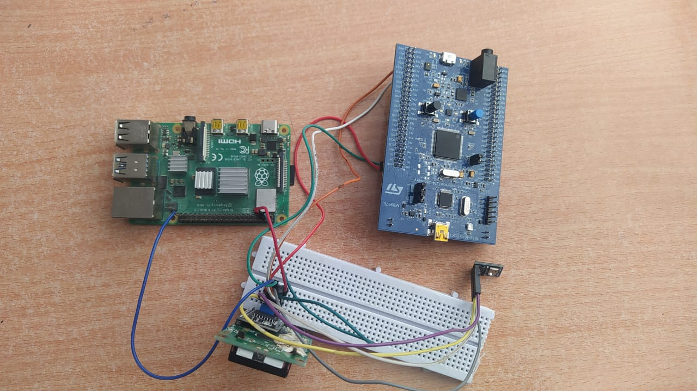
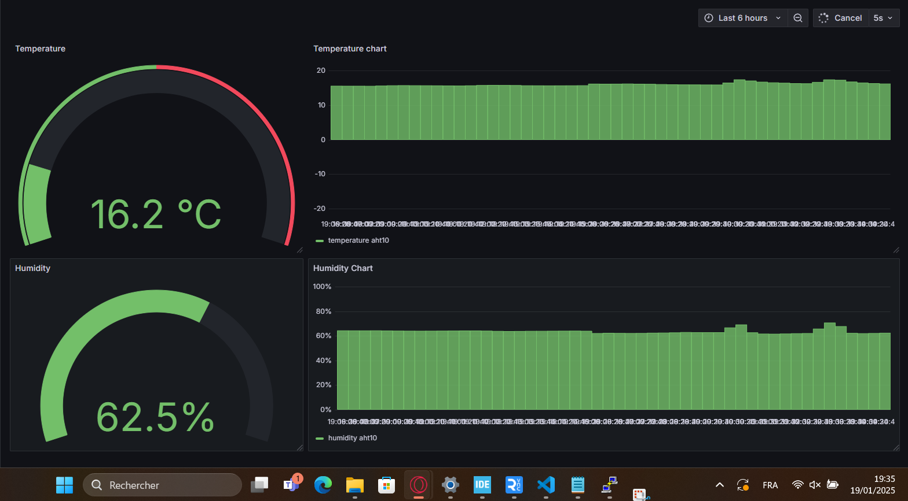

# 🌡️ I2C-Based Environmental Monitoring System

A smart system that monitors temperature and humidity using an I2C network composed of an **AHT10 sensor**, **STM32 microcontroller**, **LCD**, and a **Raspberry Pi 4**. Data is collected, displayed locally, and sent to a remote database for monitoring via **Grafana**.

---

## 📌 Project Overview

- 📈 **Readings** from the AHT10 sensor (temperature and humidity).
- 🧠 **STM32** acts as an I2C master:
  - Reads data from the AHT10.
  - Sends data to the **LCD display**.
  - Forwards data to the **Raspberry Pi 4**.
- 💾 **Raspberry Pi 4** logs the data into **InfluxDB**.
- 📊 **Grafana** provides a dashboard interface for real-time and historical data visualization.

---

## 🔧 Components Used

| Component        | Role                                                        |
|------------------|-------------------------------------------------------------|
| AHT10            | Measures temperature and humidity (I2C interface)           |
| STM32 MCU        | I2C master: reads sensor data, controls LCD, communicates with RPi |
| LCD Display (I2C)| Shows current temperature and humidity values               |
| Raspberry Pi 4   | Receives data and logs it to InfluxDB                       |
| InfluxDB         | Time-series database                                        |
| Grafana          | Visualization dashboard tool                                |

---

## 🖼️ System Visuals

### ✅ Real Photo of the System

This image shows the physical hardware connections including STM32, AHT10 sensor, Raspberry Pi, and LCD.

---

### 📊 Grafana Dashboard

Live data is visualized in Grafana using real-time graphs of temperature and humidity:

